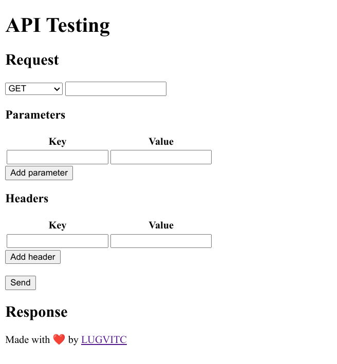

# api-testing

An API Testing tool which has the options of testing an API with all HTTP methods, HTTP headers and query parameters. Currently in the development stage, we encourage all contributors to implement features in the project.  
  
# Project structure
* to be written

# Test the project locally
* Fork the repo.
* Clone your copy of the repo to your local machine.
* Open `index.html` in a browser. 
* You should be able to see all the options currently implemented in the page.
* to be written

# Roadmap of features expected
* to be written

# Contributing
Thank you for your interest in contributing for the project. Checkout the [Contributing Guidelines](https://github.com/lugvitc/api-testing/blob/master/CONTRIBUTING.md) before submitting any PR. Submit small changes in a single PR so that it is easier to review (for instance, work on one feature in one PR). 
